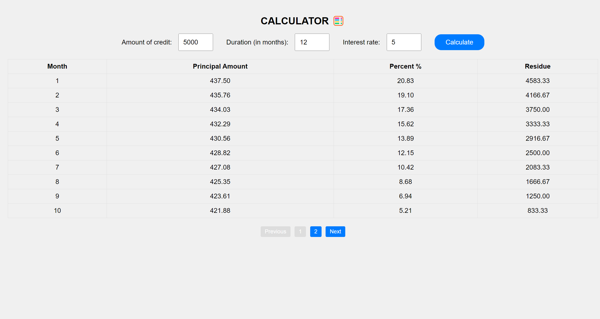

# Тестовое задание

Разработать одностраничное приложение - 🧮 кредитный калькулятор на React.
Приложение должно запрашивать у пользователя:

- сумму
- срок
- процентную ставку
  и после завершения выводить таблицу с графиком погашения кредита.

Все вычисления должны выполняться на клиенте. Дизайн UI/UX особого значения не имеют, но при этом необходимо написать максимально чистый и читаемый TS-код.

Результат работы разместить на GitHub / GitLab pages (на выбор).

➕ Будет плюсом если при отрисовке таблицы большого объема будет реализована пагинация или виртуальный рендеринг (можно воспользоваться сторонними библиотеками).

